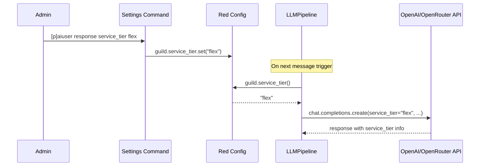

# Plan: Add `service_tier` Support to aiuser

## Overview

Add a per-server configurable `service_tier` parameter that gets passed to OpenAI-compatible API calls (OpenRouter, OpenAI). This controls cost/latency tradeoffs — `flex` for lower cost/higher latency, `priority` for faster/higher cost.

## Architecture

## Changes by File

### 1. `aiuser/config/defaults.py`
- Add `"service_tier": None` to `DEFAULT_GUILD` dict
- `None` means the parameter is not sent (API uses its own default)

### 2. `aiuser/types/enums.py`
- Add `ServiceTier` enum:
  - `DEFAULT = None` — does not send `service_tier` parameter
  - `FLEX = "flex"` — lower cost, higher latency
  - `PRIORITY = "priority"` — faster, higher cost

### 3. `aiuser/settings/response.py`
- Add new subcommand `[p]aiuser response service_tier [tier]`
  - Accepts: `default`, `flex`, `priority`, or `none`/`reset` (same as `default`)
  - Requires `admin_or_permissions(manage_guild=True)` (same as other response settings)
  - Shows current value when no argument given
  - Validates input against the `ServiceTier` enum

### 4. `aiuser/response/chat/llm_pipeline.py`
- In `get_custom_parameters()`: read `service_tier` from guild config and add to kwargs when not `None`
- This flows through to `call_client()` → `_create_completion_with_retry()` → `openai_client.chat.completions.create(service_tier=...)`
- The OpenAI Python SDK natively supports `service_tier` as a keyword argument

### 5. `aiuser/settings/base.py`
- In the `config` command embed: add a field showing the current `service_tier` value alongside other response settings

### 6. `aiuser/dashboard/owner_config_page.py`
- Add a `wtforms.SelectField` for `service_tier` with choices: `default`, `flex`, `priority`
- Wire up save/load with `self.config.guild(guild).service_tier`

## Key Design Decisions

1. **Per-server setting**: Matches existing pattern (model, reply_percent, etc. are per-server)
2. **Owner-only command**: Since `service_tier` affects billing/cost, it uses `@checks.is_owner()` like the `parameters` command
3. **Default is None**: When `None`, the parameter is omitted entirely — the API decides the tier
4. **Stored as string in config**: `"flex"`, `"priority"`, or `None` — simple and compatible with Red's Config backend

## Notes

- `service_tier` is a **top-level** request body parameter, not nested in `extra_body`. The OpenAI SDK accepts it directly.
- The `service_tier` value from the **response** (which tier was actually used) is not currently logged/displayed, but could be added as a follow-up enhancement.
